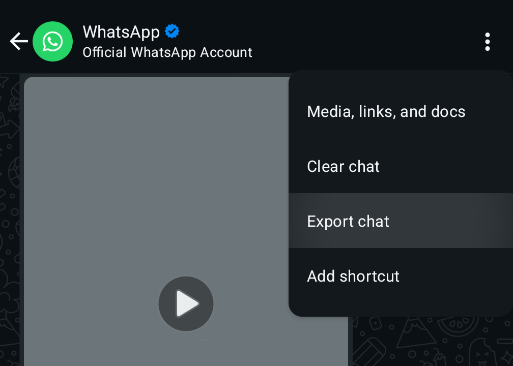

# WhatsApp Message Analyzer 📱

A beautiful and interactive web application that analyzes your WhatsApp chat exports to provide insightful statistics, visualizations, and fun facts about your conversations.


## ✨ Features

### 📊 **Comprehensive Analytics**
- **Message Statistics**: Total messages, words, unique words, images sent
- **Activity Patterns**: Longest messaging streak analysis
- **Time-based Filtering**: Analyze specific date ranges with interactive slider

### 📈 **Interactive Visualizations**
- **Timeline Charts**: Monthly activity breakdown
- **Activity by Day**: Pie chart showing messaging patterns by weekday
- **Activity by Hour**: Bar chart revealing when you're most active
- **Word Frequency**: Visual representation of most and least used words
- **Emoji Analysis**: Most and least used emojis with frequency data

### 🔍 **Advanced Search & Analysis**
- **Message Search**: Find specific words and see their usage patterns
- **Random Generators**: Get random words, messages, or wholesome phrases
- **Date-specific Messages**: View all messages from any specific day
- **Rare Finds**: Discover your least used words and emojis

### 🎨 **Beautiful Design**
- WhatsApp-inspired color scheme (green gradient background)
- Responsive design that works on all devices
- Clean, modern interface with smooth animations
- Interactive elements with hover effects

## 🚀 Getting Started

### Prerequisites
- A modern web browser (Chrome, Firefox, Safari, Edge)
- WhatsApp chat export file (.txt format)

### Installation
1. **Clone the repository**
   ```bash
   git clone https://github.com/griffing52/WhatsappMessageAnalyzer.git
   cd WhatsappMessageAnalyzer
   ```

2. **Open the application**
   - Simply open `index.html` in your web browser
   - Or serve it using a local web server:
   ```bash
   # Using Python
   python -m http.server 8000
   
   # Using Node.js (if you have http-server installed)
   npx http-server
   ```

3. **Access the app**
   - Open your browser and navigate to the file or localhost address
   - You're ready to analyze your chats! 🎉

## 📱 How to Export Your WhatsApp Chat

1. **Open WhatsApp** on your phone
2. **Navigate to the chat** you want to analyze
3. **Tap the three dots** (⋮) in the top right corner
4. **Select "More"** from the menu
5. **Choose "Export chat"**
6. **Select "Without Media"** for faster processing
7. **Save the .txt file** to your device



## 🎯 How to Use

1. **Upload Your Chat**: Click "Choose File" and select your exported WhatsApp .txt file
2. **Click "Analyze"**: The app will process your chat and generate statistics
3. **Adjust Time Period**: Use the date range slider to filter messages by specific periods
4. **Explore Results**: Scroll through various sections to see:
   - Message statistics and fun facts
   - Most/least used words and emojis
   - Interactive charts and visualizations
   - Search functionality for specific words
   - Random message and word generators

## 🛠️ Technical Details

### Built With
- **HTML5**: Semantic markup and structure
- **CSS3**: Modern styling with gradients and animations
- **Vanilla JavaScript**: Core functionality and data processing
- **Chart.js**: Interactive charts and visualizations
- **jQuery & jQuery UI**: Date range slider and UI components

### Key Features
- **Client-side Processing**: Your data never leaves your browser
- **Privacy-focused**: No data is sent to external servers
- **Real-time Filtering**: Dynamic date range filtering
- **Responsive Design**: Works on desktop, tablet, and mobile
- **Export Functionality**: Download word frequency data as CSV

### File Structure
```
WhatsappMessageAnalyzer/
├── index.html          # Main application page
├── how_to_use.html     # Instructions page
├── main.js             # Core JavaScript functionality
├── style.css           # Styling and animations
├── explanation.png     # Tutorial image
├── LICENSE             # MIT License
└── README.md           # This file
```

## 📝 License

This project is licensed under the MIT License - see the [LICENSE](LICENSE) file for details.

## 🙏 Acknowledgments

- Chart.js for beautiful visualizations
- jQuery UI for the date range slider
- WhatsApp for the inspiration and color scheme
- The open-source community for tools and libraries

## 📞 Support

If you encounter any issues or have questions:
- Check the [Issues](https://github.com/griffing52/WhatsappMessageAnalyzer/issues) page
- Create a new issue if your problem isn't already addressed
- Make sure to include your browser version and any error messages

## ⭐ Star History

If you found this project helpful, please consider giving it a star! ⭐

---

**Made with ❤️ for WhatsApp users who love data insights**

*Analyze your conversations • Discover patterns • Relive memories*